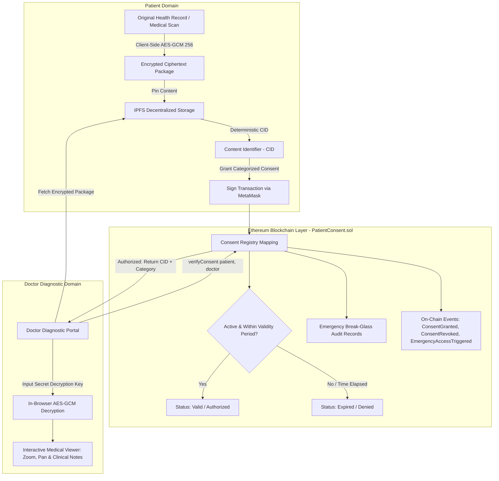

# Decentralized Patient Consent Management System (PCMS)

[](https://soliditylang.org/)
[](https://ethereum.org/)
[](https://hardhat.org/)
[](https://react.dev/)
[](https://vitejs.dev/)
[](https://docs.ethers.org/v6/)
[](https://ipfs.tech/)
[](https://github.com/VishnuSreeVidya/Patient-Consent-Management-System)
[](https://opensource.org/licenses/MIT)

> An enterprise-grade, privacy-first Web3 Electronic Health Record (EHR) access control platform engineered with **Solidity**, **IPFS**, and **AES-GCM-256** client-side cryptography. Empowers patients with self-sovereign data ownership, fine-grained consent categories, time-bound access limits, and an emergency ER break-glass protocol with an immutable on-chain audit trail.

---

## Table of Contents

1. [Executive Summary](#executive-summary)
2. [System Architecture](#system-architecture)
3. [End-to-End Workflow](#end-to-end-workflow)
4. [Core Features & Innovations](#core-features--innovations)
5. [Smart Contract Specification](#smart-contract-specification)
6. [Technology Stack](#technology-stack)
7. [Repository Structure](#repository-structure)
8. [Prerequisites & Environment Configuration](#prerequisites--environment-configuration)
9. [Step-by-Step Installation & Execution Guide](#step-by-step-installation--execution-guide)
10. [MetaMask & Testnet Configuration](#metamask--testnet-configuration)
11. [Automated Test Suite](#automated-test-suite)
12. [Security, Privacy & Regulatory Compliance](#security-privacy--regulatory-compliance)
13. [Future Roadmap](#future-roadmap)
14. [License & Acknowledgments](#license--acknowledgments)

---

## Executive Summary

Traditional healthcare infrastructure suffers from centralized data silos, vulnerability to ransomware attacks, non-transparent consent handling, and lack of granular patient control over sensitive diagnostic data.

The **Decentralized Patient Consent Management System (PCMS)** solves these fundamental challenges through a hybrid decentralized architecture:
- **Zero-Knowledge Data Confidentiality**: Medical records and diagnostic imaging are encrypted client-side in browser memory using **AES-GCM 256-bit** encryption before transmission. Centralized servers and IPFS nodes never possess unencrypted data.
- **Categorized Granular Permissions**: Instead of an all-or-nothing consent model, patients selectively authorize specific medical disciplines (e.g., prescriptions vs. psychiatric records).
- **Time-Bound Enforcement**: Consents automatically expire at the smart contract level without requiring manual patient intervention.
- **Emergency ER Break-Glass Protocol**: Verified emergency room physicians can bypass access restrictions during life-threatening crises while generating an immutable on-chain audit record for legal accountability.
- **Tamper-Evident Audit Logging**: Every grant, revocation, and emergency access event is recorded immutably on the Ethereum blockchain.

---

## System Architecture

The system operates across three secure operational layers: the **Patient Domain**, the **Ethereum Smart Contract Layer**, and the **Doctor Diagnostic Domain**.



---

## End-to-End Workflow

1. **Record Ingestion & Encryption (Patient)**:
   - Patient uploads an EHR file (PDF report, lab result, or high-resolution scan image).
   - The browser derives a 256-bit AES key using **PBKDF2 (100,000 SHA-256 iterations)** with random cryptographic salt and IV.
   - The ciphertext payload is packaged with metadata and pinned to IPFS, generating a deterministic IPFS Content Identifier (`CID`).
2. **On-Chain Consent Authorization**:
   - Patient specifies the authorized Doctor's Ethereum address, selects the category (`0` to `4`), and chooses a duration (e.g., 1 hour, 24 hours, 7 days, 30 days).
   - Patient signs `grantConsent(...)` via MetaMask, committing the permission to the blockchain state.
3. **Verification & Access (Doctor)**:
   - Doctor queries the patient's address via the Doctor Diagnostic Portal.
   - The smart contract evaluates `block.timestamp <= consent.validUntil` and `consent.isGranted`.
   - If verified, the contract returns `hasAccess = true`, the target `ipfsCID`, and the authorized `category`.
4. **In-Browser Decryption & Diagnostic Inspection**:
   - The client fetches the encrypted blob from IPFS and decrypts it in browser memory.
   - The built-in diagnostic viewer displays clinical notes and diagnostic imaging with interactive zoom (`50%` to `200%`).
5. **Revocation & Emergency Bypass**:
   - The patient can invoke `revokeConsent(...)` at any time to immediately cut off access on-chain.
   - In trauma emergencies, doctors can trigger `emergencyBreakGlass(...)` with written medical justification, emitting an immutable ER audit record.

---

## Core Features & Innovations

### 1. Granular Categorized Consent
Patients can restrict access based on medical context:
- **General EHR (0)**: Routine vitals, general consultation notes, medical history.
- **Prescriptions (1)**: Pharmacy orders, drug dosages, prescription refills.
- **Lab & Blood Work (2)**: Pathology results, hematology panels, metabolic panels.
- **Radiology & Scans (3)**: DICOM images, X-Rays, MRIs, CT scans, ultrasounds.
- **Sensitive / Mental Health (4)**: Psychiatric evaluations, genetic screening, oncology reports.

### 2. Emergency "Break-Glass" Protocol
In sudden life-threatening trauma situations where a patient is incapacitated:
- ER physicians can trigger the break-glass procedure with mandatory clinical justification.
- Emits `EmergencyAccessTriggered(patient, doctor, reason, timestamp)`.
- Prevents critical treatment delays while ensuring full forensic accountability and zero post-hoc repudiation.

### 3. Client-Side Cryptographic Vault
- **Zero Plaintext Exposure**: Files never leave the client without authenticated encryption (**AES-GCM** with 128-bit authentication tags).
- **PBKDF2 Key Derivation**: High-iteration key stretching prevents brute-force dictionary attacks.
- **Decentralized Pinning**: Records are addressed content-addressedly via IPFS, eliminating single points of failure.

### 4. Interactive Diagnostic Document & Scan Viewer
- Integrated pan/zoom controls (**50% to 200%**) designed specifically for diagnostic scans (X-Rays, CT, MRI).
- Built-in PDF reader for multi-page lab reports.
- Clinical note viewer displaying diagnostic summaries and practitioner instructions.
- One-click export for verified local record archiving.

### 5. Live Blockchain Audit Trail
- WebSocket / JSON-RPC event listeners continuously ingest on-chain activity.
- Visual status indicators distinguishing standard consent grants, manual revocations, and high-priority ER break-glass events.
- Displays transaction hashes linking to block explorers.

### 6. Multi-Record Patient Health Vault
- Persistent client-side repository for managing multiple medical records (e.g. ECGs, blood tests, radiology scans).
- Interactive category filter tabs (`All`, `General`, `Prescriptions`, `LabTests`, `Radiology`, `Sensitive`).
- 1-Click *"Use in Consent"* flow that auto-populates CIDs and category parameters directly into the on-chain grant form.

### 7. Cryptographic Compliance & Consent Certificate (PDF / Print)
- In-app generation of formal, HIPAA-aligned **Web3 Medical Authorization Certificates**.
- Details on-chain transaction hashes, block timestamps, doctor/patient addresses, and verification seals.
- Built-in print engine (`window.print()`) formatted for 1-click PDF export and clinical auditing.

### 8. High-Priority Emergency ER Alert Banner
- Real-time detection of emergency break-glass invocations on the patient's record.
- Prominent red alert banner displaying doctor address, timestamp, and clinical justification with one-click audit certificate generation and patient acknowledgment.

---

## Smart Contract Specification

### Contract: `PatientConsent.sol`
- **Solidity Version**: `^0.8.20`
- **EVM Target**: `paris`
- **License**: `MIT`

### Data Structures

```solidity
enum RecordCategory {
    General,        // 0
    Prescriptions,  // 1
    LabTests,       // 2
    Radiology,      // 3
    Sensitive       // 4
}

struct Consent {
    bool isGranted;          // Active permission flag
    RecordCategory category; // Medical category identifier
    uint256 validUntil;      // Unix epoch expiration timestamp
    string ipfsCID;          // IPFS content identifier
}

struct EmergencyAccess {
    address doctor;          // Requesting physician address
    uint256 timestamp;       // Block timestamp of incident
    string reason;           // Mandatory justification string
}
```

### State Mappings
```solidity
// patientAddress => doctorAddress => Consent record
mapping(address => mapping(address => Consent)) public consentRegistry;

// patientAddress => Array of Emergency Access records
mapping(address => EmergencyAccess[]) private emergencyAccessLogs;
```

### Public & External API

| Function | Visibility | Description |
| :--- | :--- | :--- |
| `grantConsent(address _doctor, string _ipfsCID, uint8 _category, uint256 _durationInSeconds)` | `external` | Authorizes a doctor with category and expiration period. Emits `ConsentGranted`. |
| `revokeConsent(address _doctor)` | `external` | Revokes an existing doctor consent immediately. Emits `ConsentRevoked`. |
| `verifyConsent(address _patient, address _doctor)` | `external view` | Returns `(bool hasAccess, string memory ipfsCID, uint8 category)`. Evaluates active status and expiry. |
| `emergencyBreakGlass(address _patient, string memory _reason)` | `external` | Emergency room access trigger with justification. Emits `EmergencyAccessTriggered`. |
| `getEmergencyAccessLogs(address _patient)` | `external view` | Returns array of `EmergencyAccess` records for forensic patient auditing. |

### Smart Contract Events

```solidity
event ConsentGranted(
    address indexed patient,
    address indexed doctor,
    string ipfsCID,
    uint8 category,
    uint256 validUntil
);

event ConsentRevoked(
    address indexed patient,
    address indexed doctor
);

event EmergencyAccessTriggered(
    address indexed patient,
    address indexed doctor,
    string reason,
    uint256 timestamp
);
```

---

## Technology Stack

| Layer | Component | Version | Purpose |
| :--- | :--- | :--- | :--- |
| **Smart Contracts** | Solidity | `^0.8.20` | On-chain consent registry, time locks, and event emission |
| **Development Environment** | Hardhat | `2.22.x` | EVM local node, contract compilation, gas optimization, unit tests |
| **Web3 Client** | Ethers.js | `v6.17.x` | JSON-RPC provider, MetaMask wallet signer, contract ABI interface |
| **Frontend Framework** | React | `19.x` | Reactive component architecture, hook-based UI state |
| **Build Tooling** | Vite | `8.2.x` | Sub-second HMR development server, optimized ESM production bundler |
| **Decentralized Storage** | IPFS | Modern CIDv0/v1 | Decentralized immutable content-addressed storage |
| **Cryptography** | Web Crypto API | Standard | In-browser PBKDF2 (100k iterations) and AES-GCM-256 |
| **Styling & Icons** | Tailwind CSS + Lucide | `v4 / v1` | Responsive glassmorphism interface and accessible icon set |
| **Deployment** | Vercel | Production | Single-Page Application (SPA) edge hosting |

---

## Repository Structure

```text
Patient-Consent-Management-System/
|-- backend/
|   |-- contracts/
|   |   \-- PatientConsent.sol        # Core Ethereum Smart Contract
|   |-- scripts/
|   |   \-- deploy.cjs                # Automated Hardhat deployment script
|   |-- test/
|   |   \-- PatientConsent.test.cjs   # 9 Comprehensive unit test suites
|   |-- hardhat.config.cjs           # EVM networks (localhost, Sepolia, Amoy)
|   |-- .env.example                 # Backend environment variable template
|   \-- package.json                 # Backend dependencies & scripts
|-- frontend/
|   |-- src/
|   |   |-- components/
|   |   |   |-- PatientPortal.jsx     # Encrypted vault, category selector & consent registry
|   |   |   |-- DoctorPortal.jsx      # Consent verification, Break-Glass modal & scan viewer
|   |   |   |-- AuditLog.jsx          # Live blockchain event stream & ER audit logging
|   |   |   \-- ConsentCertificateModal.jsx # Cryptographic HIPAA/Web3 compliance certificate
|   |   |-- contracts/
|   |   |   \-- contractConfig.js     # Contract ABI, addresses & category styling tokens
|   |   |-- services/
|   |   |   \-- ipfs.js               # Web Crypto AES-GCM 256 engine & IPFS mock vault
|   |   |-- App.jsx                   # Web3 provider connection, wallet state & routing
|   |   |-- main.jsx                  # React application root entry point
|   |   \-- index.css                 # Glassmorphic Tailwind CSS design system
|   |-- index.html                    # Single Page Application HTML entry
|   |-- vercel.json                   # Vercel SPA routing rewrite rules
|   |-- .env.example                  # Frontend environment variable template
|   |-- vite.config.js                # Vite build configuration
|   \-- package.json                  # Frontend dependencies & scripts
\-- README.md                         # Comprehensive System Documentation
```

---

## Prerequisites & Environment Configuration

### System Requirements
- **Node.js**: `v18.0.0` or `v20.0.0+`
- **Package Manager**: `npm` (`v9+`) or `yarn`
- **Web3 Wallet**: [MetaMask](https://metamask.io/) browser extension installed
- **Operating System**: Windows, macOS, or Linux

### Environment Configuration

1. **Backend Configuration** (`backend/.env`):
   ```bash
   cp backend/.env.example backend/.env
   ```
   ```dotenv
   SEPOLIA_RPC_URL="https://eth-sepolia.g.alchemy.com/v2/YOUR_ALCHEMY_KEY"
   AMOY_RPC_URL="https://polygon-amoy.g.alchemy.com/v2/YOUR_ALCHEMY_KEY"
   PRIVATE_KEY="your_wallet_private_key_here"
   ETHERSCAN_API_KEY="your_etherscan_api_key"
   ```

2. **Frontend Configuration** (`frontend/.env`):
   ```bash
   cp frontend/.env.example frontend/.env
   ```
   ```dotenv
   VITE_CONTRACT_ADDRESS="0x5FbDB2315678afecb367f032d93F642f64180aa3"
   VITE_CHAIN_ID="31337"
   ```

---

## Step-by-Step Installation & Execution Guide

### 1. Clone the Repository
```bash
git clone https://github.com/VishnuSreeVidya/Patient-Consent-Management-System.git
cd Patient-Consent-Management-System
```

### 2. Start Local Ethereum Blockchain (Terminal 1)
Open an integrated terminal in your IDE (e.g., VS Code):
```powershell
cd backend
npm install
npx hardhat node
```
> Keep this terminal running! Hardhat starts an EVM test network at `http://127.0.0.1:8545` with 20 pre-funded test accounts (10,000 ETH each).

### 3. Deploy Smart Contract to Localhost (Terminal 2)
In a second terminal window:
```powershell
cd backend
npx hardhat run scripts/deploy.cjs --network localhost
```
*Expected Output:*
```text
PatientConsent deployed to: 0x5FbDB2315678afecb367f032d93F642f64180aa3
```

### 4. Run Automated Smart Contract Tests
Ensure contract security and functionality:
```powershell
cd backend
npx hardhat test
```

### 5. Launch Frontend Development Server
In a third terminal window:
```powershell
cd frontend
npm install
npm run dev
```
Open **`http://localhost:5173`** in your browser.

---

## MetaMask & Testnet Configuration

### Configure Localhost RPC in MetaMask
1. Open MetaMask > Click the **Network Selector** (top-left) > **Add Network** > **Add a network manually**.
2. Enter the following parameters:
   - **Network Name**: `Hardhat Localhost`
   - **New RPC URL**: `http://127.0.0.1:8545`
   - **Chain ID**: `31337`
   - **Currency Symbol**: `ETH`
3. Click **Save**.

### Import Pre-Funded Test Accounts
Import the private keys output by `npx hardhat node` to test both Patient and Doctor workflows:
- **Patient Account (Account #0)**:
  - Address: `0xf39Fd6e51aad88F6F4ce6aB8827279cffFb92266`
  - Private Key: `0xac0974bec39a17e36ba4a6b4d238ff944bacb478cbed5efcae784d7bf4f2ff80`
- **Doctor Account (Account #1 - Cardiology / Diagnostic)**:
  - Address: `0x70997970C51812dc3A010C7d01b50e0d17dc79C8`
  - Private Key: `0x59c6995e998f97a5a0044966f0945389dc9e86dae88c7a8412f4603b6b78690d`
- **Emergency ER Doctor (Account #2 - ER Trauma)**:
  - Address: `0x90F79bf6Eb2c4E8a895F1297be8883876E539771`
  - Private Key: `0x5de4111afa1a4b94908f83103eb1f1706367c2e68ca870fc3fb9a804cdab365a`

---

## Automated Test Suite & Verification Guide

### 1. Automated Smart Contract Unit Tests
The test suite in `backend/test/PatientConsent.test.cjs` validates all contract behaviors, boundary conditions, edge cases, and event emissions.

```text
  PatientConsent Management System
    Deployment
      [PASS] Should deploy successfully and have a valid address
    Grant Categorized Consent
      [PASS] Should allow a patient to grant categorized consent and emit ConsentGranted event (106ms)
      [PASS] Should reject granting consent to address(0)
    Verify Consent
      [PASS] Should verify active consent and category for authorized doctor
      [PASS] Should deny access to unauthorized doctor
      [PASS] Should deny access to self grant
      [PASS] Should deny access when consent expires after duration
    Revoke Consent
      [PASS] Should allow patient to revoke consent and emit ConsentRevoked event
    Emergency Break-Glass Protocol
      [PASS] Should log emergency break-glass access and emit event

  9 passing (797ms)
```

### 2. End-to-End Functional Verification Checklist

| Step | Action | Expected On-Chain / UI Result |
| :---: | :--- | :--- |
| **1** | **Vault Ingestion** | Encrypted payload generated, deterministic IPFS CID calculated, record saved to vault. |
| **2** | **Grant Consent** | Patient signs `grantConsent` via MetaMask; countdown timer & category pill appear in Active Registry. |
| **3** | **Compliance Certificate** | Clicking **Certificate** renders printable HIPAA/Web3 certificate with cryptographic serial ID. |
| **4** | **Doctor Verification** | Doctor queries patient address; contract confirms `hasAccess = true` and displays category badge. |
| **5** | **Decryption & Diagnostic Viewer** | Entering secret key decrypts record; interactive viewer allows 50% to 200% scan zoom. |
| **6** | **Emergency Break-Glass** | ER physician logs emergency trauma bypass; emits `EmergencyAccessTriggered` on-chain. |
| **7** | **Patient Alert Banner** | Red alert banner automatically notifies patient upon login with doctor ID and clinical justification. |
| **8** | **Live Audit Trail** | Event stream displays real-time block timestamps, transaction hashes, and category tags. |
| **9** | **Access Revocation** | Patient clicks **Revoke**; doctor verification instantly switches to `NO ACTIVE CONSENT`. |

---

## Security, Privacy & Regulatory Compliance

| Principle | Implementation Details |
| :--- | :--- |
| **HIPAA / GDPR Confidentiality** | Plaintext health records are never broadcast over the network or saved in cloud storage. Decryption keys are managed client-side by patients and shared only with authorized practitioners. |
| **Cryptographic Integrity** | Uses AES-GCM with 128-bit authentication tags to verify ciphertext authenticity and prevent bit-flipping attacks. |
| **Zero-Knowledge Storage** | Files pinned to IPFS are stored purely as encrypted binary blobs. Without the symmetric key, IPFS nodes and gateways cannot decipher medical data. |
| **Replay & Sybil Protection** | Smart contract function calls require nonced, gas-metered cryptographic signatures generated by the caller's private key. |
| **Deterministic Access Verification** | Permissions are determined purely by verified blockchain timestamps and mapped registry states, eliminating centralized administrative backdoors. |

---

## Future Roadmap

- [ ] **Asymmetric ECIES Encryption**: Incorporate MetaMask's `eth_getEncryptionPublicKey` and `eth_decrypt` for passwordless, zero-shared-secret doctor authorization.
- [ ] **Multi-Signature Break-Glass**: Require two independent hospital physician signatures to authorize emergency access.
- [ ] **Zero-Knowledge Proof of Consent (zk-SNARKs)**: Enable verification of patient consent without revealing patient or doctor identities on public ledgers.
- [ ] **Decentralized Identity (DID / Verifiable Credentials)**: Integrate W3C DID standards for verified medical practitioner licensing checks.

---

## License & Acknowledgments

This project is licensed under the **MIT License** - see the [LICENSE](LICENSE) file for details.

### Acknowledgments
- [OpenZeppelin](https://openzeppelin.com/) for smart contract security principles.
- [IPFS / Filecoin](https://ipfs.tech/) for decentralized content addressing.
- [Hardhat Community](https://hardhat.org/) for Ethereum developer tooling.

---

*Engineered with precision for patient sovereignty, healthcare security, and decentralized data integrity.*
