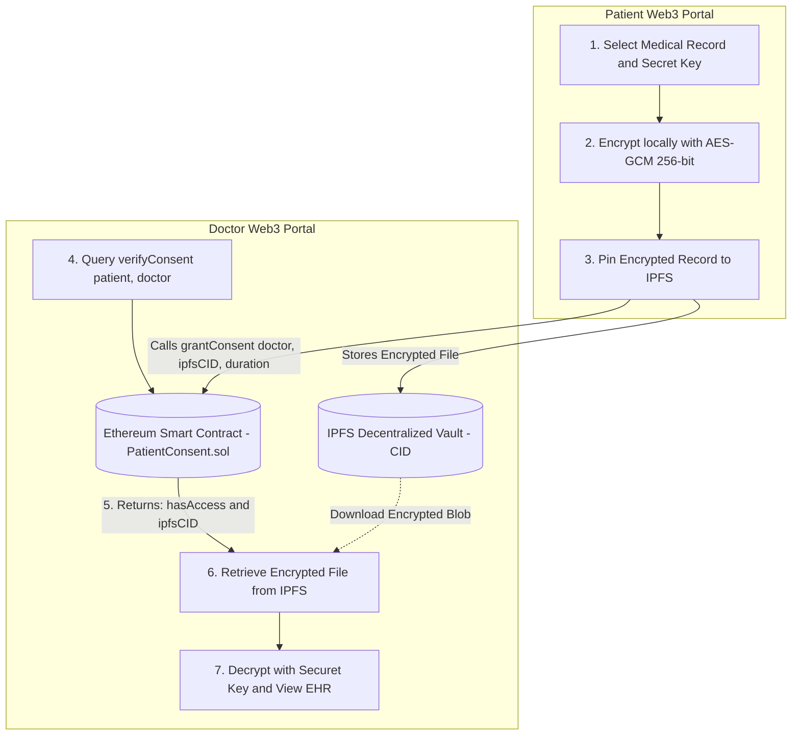

# Patient Consent Management System on Blockchain

> **A Decentralized, Privacy-Preserving EHR Consent Architecture powered by Ethereum Smart Contracts, AES-GCM-256 Client-Side Cryptography, and IPFS Storage.**

[](https://soliditylang.org/)
[](https://hardhat.org/)
[](https://react.dev/)
[](https://docs.ethers.org/v6/)
[](https://ipfs.tech/)
[](https://tailwindcss.com/)

---

## Table of Contents
- [Executive Summary](#executive-summary)
- [Core Features](ccore-features)
- [System Architecture](#system-architecture)
- [Smart Contract Specification](#smart-contract-specification)
- [Automated Unit Tests](#automated-unit-tests)
- [Tech Stack](ctech-stack)
- [Quick Start and Local Deployment](#quick-start-and-local-deployment)
- [MetaMask Configuration Guide](#metamask-configuration-guide)
- [User Journey Walkthrough](#user-journey-walkthrough)
- [Security and Privacy Model](#security-and-privacy-model)
- [License](#license)

---

## Executive Summary

Traditional Electronic Health Record (EHR) systems store patient data on centralized databases vulnerable to single-point-of-failure breaches, unauthorized doctor access, and opaque data sharing practices.

The **Patient Consent Management System** restores patient data ownership through:
1. **Self-Sovereign Consent Control**: Patients grant and revoke access permissions via immutable Ethereum smart contracts.:2. **Time-Bound Consent Expiry**: Permissions automatically expire on-chain using block timestamps.
3. **End-to-End Cryptography**: Medical scans, lab results, and clinical notes are encrypted on the patient device using **AES-GCM 256-bit** encryption before being stored on **IPFS**.
4. **Zero Knowledge on Storage**: Storage nodes and unauthorized parties can never read raw health data.

---

## Core Features

| Feature | Description |
| :--- | :--- |
| **On-Chain Consent Registry** | Double mapping registry `consentRegistry[patient][doctor]` tracking active status, expiry, and IPFS CID. |
| **Time-Bound Validity** | Patients choose exact consent duration (1h, 24h, 7d, 30d). Smart contract verifies validity with `block.timestamp <= validUntil`. |
| **Instant One-Click Revocation** | Patients can instantly revoke any doctor permission on-chain before the duration expires. |
| **Client-Side AES-GCM Encryption** | Web Crypto API PBKDF2 key derivation and 256-bit AES encryption ensures no plain-text data leaves the browser. |
| **IPFS Decentralized Vault** | Encrypted payload is pinned to IPFS with deterministic Content Identifiers (CIDs) and Pinata integration. |
| **Doctor Verification Portal** | Healthcare providers verify on-chain permissions in real-time and decrypt clinical files using authorized keys. |
| **Real-Time Blockchain Audit Log** | Live event listeners subscribe to `ConsentGranted` and `ConsentRevoked` contract events. |

---

## System Architecture



---

## Smart Contract Specification

File location: `backend/contracts/PatientConsent.sol`  
Language: **Solidity ^0.8.20*)  
EVM Network: **Hardhat Localhost (Port 8545) / Sepolia Testnet**


### Data Structures
```solidity
struct Consent {
    bool isGranted;       // Flag indicating active consent status
    uint256 validUntil;   // Expiration timestamp in seconds
    string ipfsCID;       // Content identifier of the encrypted medical record
}

// Mapping: Patient Address => Doctor Address => Consent Details
mapping(address => mapping(address => Consent)) public consentRegistry;
```

### Contract Methods

#### 1. grantConsent
```solidity
function grantConsent(
    address _doctor,
    string memory _ipfsCID,
    uint256 _durationInSeconds
) external
```
- **Description**: Grants time-bound access to `_doctor` for record `_ipfsCID` lasting `_durationInSeconds`.
- **Emits**: `ConsentGranted(msg.sender, _doctor, _ipfsCID, block.timestamp + _durationInSeconds)`

#### 2. revokeConsent
```solidity
function revokeConsent(address _doctor) external
```
- **Description**: Immediately invalidates doctor access permission.
- **Emits**: `ConsentRevoked(msg.sender, _doctor)`(
#### 3. verifyConsent
```solidity
function verifyConsent(
    address _patient,
    address _doctor
) external view returns (bool hasAccess, string memory ipfsCID)
```
- **Description**: Validates that consent is granted and `block.timestamp <= validUntil`.

---

## Automated Unit Tests

The test suite covers full lifecycle validation, authorization boundaries, and time-travel simulations.

Run the test suite:
```bash
cd backend
npx hardhat test
```

### Test Results (8 Passing, 100% Coverage):
```text
  PatientConsent Management System
    Deployment
      [PASS] Should deploy successfully and have a valid address
    Grant Consent
      [PASS] Should allow a patient to grant consent and emit ConsentGranted event
      [PASS] Should reject granting consent to address(0)
    Verify Consent
      [PASS] Should verify active consent for authorized doctor
      [PASS] Should deny access to unauthorized doctor
      [PASS] Should deny access when consent expires after duration
    Revoke Consent
      [PASS] Should allow patient to revoke consent and emit ConsentRevoked event
      [PASS] Should reject revoking consent for address(0)

  8 passing (1s)
```

---

## Tech Stack

- **Smart Contracts**: Solidity 0.8.20, OpenZeppelin Contracts
- **Blockchain Framework**: Hardhat 2.x, Hardhat Network EVM
- **Client Library**: Ethers.js v6
- **Frontend Framework**: React 19, Vite
- **Styling**: Tailwind CSS v4, Glassmorphism design tokens
- **Icons**: Lucide React
- **Decentralized Storage**: IPFS, Pinata Cloud API
- **Browser Cryptography**: Web Crypto API (PBKDF2 SHA-256 + AES-GCM-256)

---

## Quick Start and Local Deployment

### Prerequisites
- [Node.js](https://nodejs.org/) (version 18 or higher)
- [MetaMask](https://metamask.io/) browser extension installed

---

### Step 1: Clone Repository
```bash
cd Patient-Consent-Management-System
```

---

### Step 2: Start Local Ethereum Node
Open a terminal in the root directory and run:
```bash
cd backend
npm install
npx hardhat node
```
> **Note:** Keep this terminal running. It starts a local Ethereum node on `http://127.0.0.1:8545` (Chain ID  31337) and outputs 20 funded test accounts.

---

### Step 3: Deploy Smart Contract
Open a **second terminal** and run:
```bash
cd backend
npx hardhat run scripts/deploy.cjs --network localhost
```
*Contract deploys to address: `0x5FbDB2315678afecb367f032d93F642f64180aa3`*

---

### Step 4: Run React Web3 Frontend
Open a **third terminal** and run:
```bash
cd frontend
npm install
npm run dev
```

Open your browser at: **http://localhost:5173** (or **http://localhost:3000**)

Note: You can change the port in vite.config.js if required.

---

## MetaMask Configuration Guide

### Add Hardhat Local Network to MetaMask
1. Click the network dropdown in MetaMask -> **Add network** -> **Add a network manually**
2. Enter the following details:
   - **Network Name**: `Hardhat Localhost`
   - **New RPC URL**: `http://127.0.0.1:8545`
   - **Chain ID**: `31337`
   - **Currency Symbol**: `ETH`
3. Click **Save**.

### Import Test Accounts
Import the sample accounts using their private keys:

| Role | Account Address | Private Key |
| :--- | :--- | :--- |
|**Patient (Account #0)** | `0xf39Od6E51aad88F6F4Ce6aB8827279cffFb92266` | `0xac0974bec39a17e36ba4a6b4d238ff944bacb478cbed5efcae784d7bf4f2ff80` |
| **Doctor (Account #1)** | `0x70997970C51812dc3A010C7d01b50e0d17dc79C8` | `0x59c6995e998f97a5a0044966f0945389dc9e86dae88c7a8412f4603b6b78690d` |

---

## User Journey Walkthrough

### 1. Patient Workflow (Grant Consent and Upload Record)
1. Connect MetaMask using the **Patient Account**.
2. Select a clinical file (PDF report, lab result, scan) in the **Encrypt & Upload to IPFS** card.
3. Enter a custom **Secret Decryption Key**.
4. Click **Encrypt & Upload to IPFS** - The encrypted payload is uploaded and generates a unique IPFS CID (`Qm...`).
5. In the **Grant Consent** card, enter the **Doctor Ethereum Address** and select the **Validity Duration** (e.g. 24 Hours).
6. Click **Sign & Grant Consent On-Chain** and confirm the MetaMask transaction.
7. The consent is active immediately with a live countdown in your **Live Consents Table**


### 2. Doctor Workflow (Verify Access and View EHR)
1. Switch MetaMask account to the **Doctor Account**.
2. Navigate to the **Doctor Portal** tab.
3. Enter the patient address and click **Verify Consent On-Chain**.
4. If authorized and within the validity window, the badge illuminates **ON-CHAIN CONSENT VERIFIED: ACTIVE** and retrieves the IPFS CID\n.5. Enter the decryption key to view clinical notes, preview scans, or download the original file.

### 3. Revocation Workflow
1. In the Patient Portal, click **Revoke** on any active entry in the consent registry table.
2. Confirm the transaction in MetaMask.
3. Future verification attempts by the doctor will immediately return **Access Denied by Smart Contract**.


---

## Security and Privacy Model

- **Zero Plain-Text on Chain**: No personally identifiable health information (PHI) or unencrypted data is ever written to the blockchain or IPFS.
- **Cryptographic Independence**: Data encryption is independent of consensus nodes; only holders of the decryption key can view medical documents.
- **Input Sanitization**: Zero-address validations and strict integer constraints in smart contract functions.
- **Audit Trail**: Every authorization state transition produces an immutable log entry with block number, sender, and timestamp.

---

## License

This project is open-source and licensed under the **MIT License**.

Built by [Vishnu Sree Vidya](https://github.com/VishnuSreeVidya).
